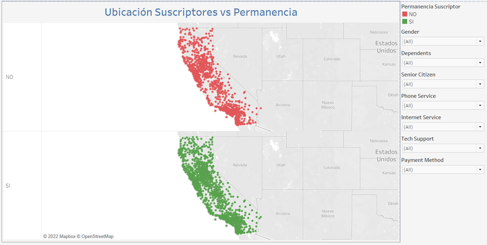
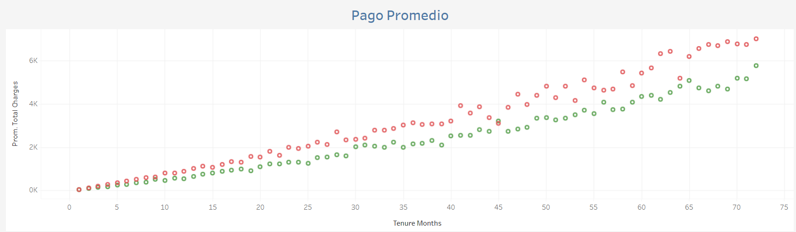
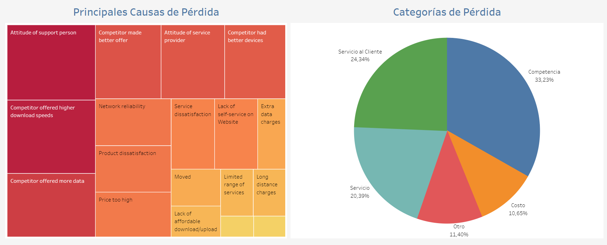
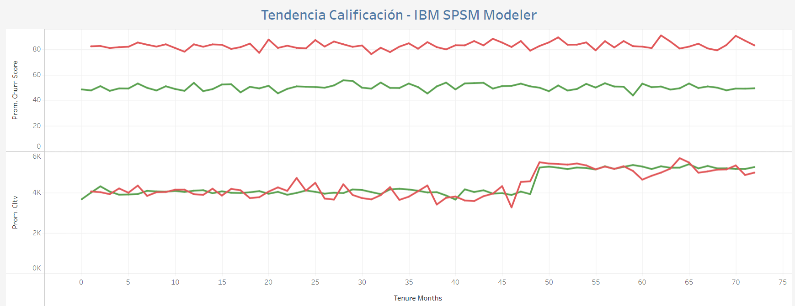

# Telecom_Churn

Se presenta un proyecto de visualización de datos, en base al análisis de las principales causas de pérdida de clientes en una empresa de telecomunicaciones. El conjunto de datos utilizado fue creado por IBM para el análisis de su herramiento SPSM Modeler con el objetivo de generar indicadores que permitan predecir la fidelidad de los clientes. 

Fuente: [Telco customer churn: IBM dataset](https://www.kaggle.com/yeanzc/telco-customer-churn-ibm-dataset)

Visualización: [Análisis de Pérdida de Clientes (Telecomunicaciones)](https://public.tableau.com/app/profile/jonathan.zambrano/viz/Anlisis_Clientes_Perdidos/Anlisis_Prdida?publish=yes)

El dataset utilizado para la visualización ha sido modificado del original para reducir el número de atributos requeridos, presentandose los siguientes:

- CustomerID (Texto): Identificador único del suscriptor.
- City (Texto): Ciudad de Residencia del suscriptor. Debido a que los datos corresponden a suscriptores del estado de California - USA, se han obviado estos parámetros.
- Latitud / Longitud (Geográfico): Datos relativos a la ubicación del suscriptor.
- Gender (Cuantitativo): Sexo del subscriptor.
- Senior Citizen (Booleano): Indicador de edad adulta, si el suscriptor supera los 65 años.
- Dependents (Booleano): Información si el subscriptor vive con hijos, padres, abuelos, etc.
- Phone Service (Booleano) / Internet Service (Texto): Indicador si el suscriptor cuenta con servicio de telefónia y/o Internet.
- Tech Support (Booleano): Indicador si el suscriptor esta afiliado a un plan de soporte técnico.
- Contract (Cuantitativo): Tipo de contrato del suscriptor.
- Payment Method (Cuantitativo): Método de pago utilizado por el suscriptor.
- Tenure Months (Entero): Tiempo en meses de permanencia del suscriptor. 
- Monthly Charges / Total Charges (US Dollars): Monto de pago del suscriptor mensual y total.
- Churn Label (Booleano): Indicador de deserción del suscriptor.
- Churn Score (Entero): Indicador de Calificación de suscriptor, que ha sido calculado utilizando la herramienta IBM SPSS Modeler para predecir deserción del suscriptor. 
- CLTV (Customer Lifetime Value) (Entero): indicador de importancia del suscriptor.
- Churn Reason (Categórico): Identificador que presenta la causa de salida del suscriptor.
- Churn Category (Categórico): Atributo creado a partir de Churn Reason, para agrupar las principales causas de deserción de los suscriptores.

La visualización contenida en el portal de Tableau se compone de tres elementos:

- En primer lugar se presenta un mapa interactivo con los diferentes parámetros de los suscriptores para que el usuario pueda evaluar que parámetros tienen mayor influencia en la deserción de suscriptores.

- A continuación se muestra una comparativa de el valor promedio de pago por mes  de los suscriptores desertados vs los que permanecen.

- Para enteder las causas de deserción, se presenta un treemap junto con un diagrama de pastel con las principales causas de deserción y su peso global.

- Finalmente, un objetivo de la visualización es entender si el modelo generado por IBM SPSM es adecuado para el mercado, se evalua la calificación "Churn Score" y "CLTV" con respecto a los suscriptores que desertarón y los que no.

